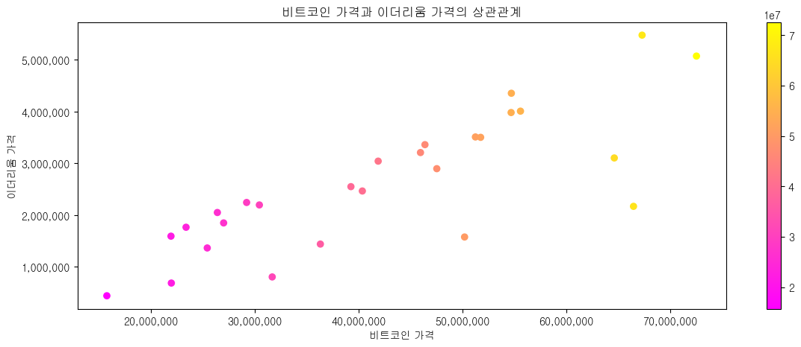

# python_semi_one
## 1. 세미 프로젝트 명
- 김치왜함

## 2. 세미 프로젝트 주제
1. 비트코인, 이더리움, 위믹스 토큰 및 루나 토큰 가격 및 거래량의 월별 자료를 통해 비트코인 과의 상관관계를 알아보고자 함.
2. 3개년 치 (2020-10 ~ 2022-12) 의 자료를 investing.com 의 과거 데이터 다운로드를 통해 자료 수집.
3. 데이터 전처리 후 matplotlib를 통해 각종 도표로 데이터 확인 진행.

## 3. WBS
|항목|2022-12-26(월)|2022-12-27(화)|2022-12-28(수)|2022-12-29(목)|2022-12-30(금)|
|:-|:-:|:-:|:-:|:-:|:-:|
|데이터 확보|완료|||||
|데이터 전처리|1차완료|2차완료|보완예정|||
|그래프 작성||1차완료||||
|데이터 보완|||예정|||
|발표자료 작성|||예정|||
|최종 보완||||예정||
|코드 리팩토링|||||예정|

## 4. 상세 내역
### 2022-12-26(월)
1.  데이터 다운로드 후 pandas 통해 각각 데이터 프레임 생성 (bit_origin, eth_origin, wemix_origin)
2. bit_origin df 데이터 전처리(bit_copy) -> NaN값 처리, 데이터형 변환, 단위 변환 등
3. 환율(월평균매매기준율) 적용하여 KRW 컬럼 추가 (서울외국환중개 자료 이용)
4. bit_krw 데이터프레임 작업 완료
5. eth_krw 데이터프레임 작업 완료
6. wemix_krw 데이터프레임 작업 완료
7. total_df 최종 데이터프레임 concat 완료

### 2022-12-27(화)
1. 최종 데이터프레임을 total_df.csv 파일로 저장
2. total_df 전처리 보완(기존 원 데이터 연월일 -> 연월로 재 다운로드 후 전처리 재진행) (datas.ipynb)
3. 각 코인별 가격 변동량 및 환율 변동 그래프 작업 완료 (plot)
4. 각 코인별 거래량 그래프 작업 완료 (bar)
5. 환율-비트코인, 환율-이더리움, 환율-위믹스, 환율-루나 간의 상관관계 그래프 작업 완료
6. 각 코인별 가격 변동량 및 거래량 간의 상관관계 그래프 작업 완료
7. 비트코인-이더리움, 비트코인-위믹스, 비트코인-루나 간의 상관관계 그래프 작업 완료

### 2022-12-28(수)
1. 데이터 보완( *필요시) : 코스피지수와의 상관관계 추가
2. 발표자료 작성

### 2022-12-29(목)
1. 최종 보완

### 2022-12-30(금)
1. 발표 진행
2. 코드 리팩토링(* 가능하면)